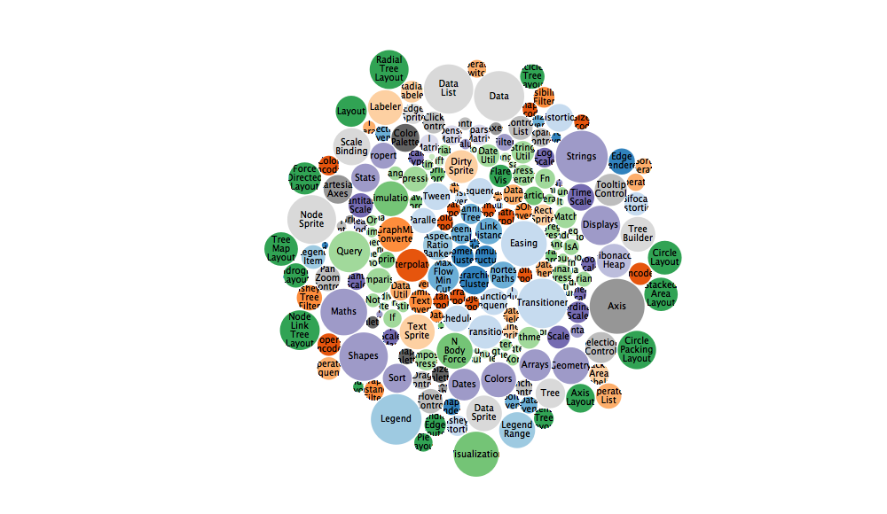

R to D3 rendering tools
================


`R2D3` provides tools to render D3 scripts from R and integrates with `knitr`, `rmarkdown` and RStudio to provide native `d3` output chunks. Specifically, with `R2D3` you can:

-   Render [D3](https://d3js.org/) scripts with ease in R as [htmlwidgets](https://www.htmlwidgets.org/).
-   Use [Shiny](http://shiny.rstudio.com/) with `R2D3` to create interactive D3 applications.

Installation
------------

Install this package by running:

``` r
devtools::install_github("rstudio/r2d3")
```

Getting Started
---------------

For simple scripts we can rely on `r2d3` injecting javascript variables for the `data`, tag which defaults to `svg` but can be changed, `width`, `height` and `options` as follows:

    Warning in file(con, "r"): file("") only supports open = "w+" and open = "w
    +b": using the former

Data can be rendered in D3 from R as follows. Notice that, for this example, we've changed the default element to `"div"` to create a `<div>` tag element instead of the default `<svg>` element:

``` r
r2d3::r2d3(
  c(10, 30, 40, 35, 20, 10),
  "inst/samples/barchart/barchart.js",
  tag = "div"
)
```


Advanced Rendering
------------------

More advanced scripts can rely can make use of `r2d3.onRender()` which is similar to `d3.csv()`, `d3.json()`, and other D3 data loading libraries, to trigger specific code during render and use the rest of the code as initialization code, for instace:

    Warning in file(con, "r"): file("") only supports open = "w+" and open = "w
    +b": using the former

``` r
flares <- read.csv("inst/samples/bubbles/flare.csv")
r2d3::r2d3(
  flares[!is.na(flares$value), ],
  "inst/samples/bubbles/bubbles.js",
  version = 4
)
```


